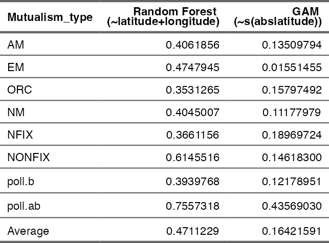

## Pichler & Hartig, 2024 - Is there a robust effect of mainland mutualism rates on species richness of oceanic islands?

Reanalysis of [Delavaux et al., 2024, “Mutualisms weaken the latitudinal
diversity gradient among oceanic
islands”](https://www.nature.com/articles/s41586-024-07110-y)

Original Repository: <https://github.com/c383d893/IslandLDG>

Changes in the original Delavaux scripts include:

- `Myc_analyses.R`: Save data that was used to produce the world map
  (Figure 1b in the original manuscript)
- `Nfix_Analyses.R`, `Myc_Analyses.R`, and `Poll_Analyses.R`: Add Random
  Forest estimator for expected mutualism ratios
- `Nfix_Analyses.R`, `Myc_Analyses.R`, and Poll_Analyses.R: Return
  observed mutualism ratio on islands
- `Joint_Analyses.R`: Calculate observed mutualism ratio on islands (new
  variable called biotic.ml_obs)
- `Joint_Analyses.R`: Calculate predicted/corrected mutualism ratio on
  islands (new variable called biotic.ml_rf)
- `Joint_Analyses.R`: Save data that was used to calculate the effects
  (e.g. Figure 2c in the original manuscript)

First, rerun all scripts from the original release to generate and save
all necessary data.

Reanalysis can be found below or as a Rscript in
`2_Analyses/Reanalysis.R`:

### Predictive performance of the models

**Table** 1: R2 of Random Forest (latitude and longitude) and
of GAM (spline on latitude)

### Figure 1 - Predicted values and corresponding effect estimates for a multiple regression using the original and the refined definition of mutualism strength as predictor

**Figure** 1: Predicted values and corresponding effect estimates for a
multiple regression using the original and the refined definition of
mutualism strength as predictor. Maps A and C show for one of the three
measures of mutualism (arbuscular mycorrhizal (AM) fungi diversity) how
predictions and performance changes between a GAM used by Delavaux et
al. (2024) with only latitude as a predictor (A) (R2 = 0.141) and a
random forest model using both longitude and latitude (R2 = 0.406).
Results for the other mutualism types were similar (across all three
mutualism types, average R2 increased from R2 = 0.149 to R2 = 0.389).
Panels B and D show the results of using these predictions of these two
alternative models in a multiple regression. Effects in panel B are
based on the mutualism strength predicted with latitude only (this
corresponds to the original analysis). Effects in panel D are based on
mutualism strength predicted by our refined model. Note that the effect
of mutualism strength on the species deficit is small and not
significant.

### Figure 2 - Accounting for nonlinear effects removes the reported effect of mutualism strength for both the original and revised definition of this variable, providing additional evidence against a robust effect of mutualists on island species richness

**Figure** 2: Accounting for nonlinear effects removes the reported
effect of mutualism strength for both the original and revised
definition of this variable, providing additional evidence against a
robust effect of mutualists on island species richness. Panel A: Due to
the methodological choices discussed earlier, the mutualism filter
strength used in Delavaux et al. (2024) is perfectly non-linear
correlated with absolute latitude. Our refined mutualism filter strength
variable that is predicted using also longitude shows more variation,
which reduces the confounding. Panel B: When the original model is
extended with splines for all variables except for the mutualism filter
strength variable, the effects of mutualism filter strength variables is
non-significant, regardless of whether we use the original and the
refined predictions for mutualists (Panel B, dotted lines). The figure
also highlights that the black solid line, corresponding to the original
effect found by Delavaux et al. (2024), is the only analysis choice that
results in a significant effect, whereas either accounting for
nonlinearities or using a better predictor of mutualisms results in n.s.
effects. Panel C shows that there is no difference between the predicted
mutualism filter strength on the mainland and the observed mutualism
(filter) strength on islands (which we calculated based on the mutualism
ratios observed on the islands, rather than predicted based on the
mutualism ratios from the mainland), as one would expect if mutualists
really had a lower chance of establishment on these islands.

### Figure S1 - Residuals diagonstic of the original model

**Figure** 3: Residuals of the model by Delavaux et al. (2024). Most
predictors show residuals patterns, indicating nonlinearities that could
potentially lead to biased estimates in the case that predictors are
nonlinearly correlated. Residuals plots were created using the DHARMa
package (2022)

### Figure S2 - Linear and non-linear fits of Area, Distance, and Absolute Latitud

Linear and non-linear fits of Area, Distance, and Absolute Latitude
based on the simple linear regression used in Delavaux et al., (2024)
and on our generalized additive model.

**Figure** 4: Linear and non-linear fits of Area, Distance, and Absolute
Latitude based on the simple linear regression used in Delavaux et al.,
(2024) and on our generalized additive model.

### Figure S3 - Influence of non-linearity and collinearity of latitude on the biotic variable effect estimate

The effect of the modelling choice of the absolute latitude variable on
the effect estimate of the biotic filter strength variable.

**Figure** 5: The effect of the modelling choice of the absolute
latitude variable on the effect estimate of the biotic filter strength
variable. Three different ways of modelling absolute latitude were
tested: no absolute latitude variable, absolute latitude as a linear
effect and absolute latitude as a spline. The biotic filter strength
variable was always set as a linear effect. The other variables
(distance, area, elevation range, precipitation, and a spatial variable
to correct for autocorrelation were set as splines). We extracted the
effect estimates (bars) and their confidence intervals (red error bars)
for the biotic filter strength variable interpolated by Delavaux et
al. 2024 (grey) and biotic filter strength variable interpolated by
random forest (black). Stars mark significant effects.

